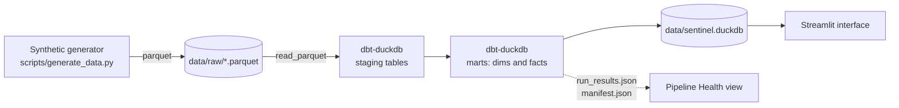

# Sentinel Fleet Operations

Operational telemetry, reliability, and pipeline status for an autonomous
sensor tower fleet. Synthetic data feeds a dbt project on DuckDB, which
materializes a small star schema consumed by a Streamlit interface.

The application surfaces three operational views over a single fact layer:

| View | Audience | Questions answered |
|---|---|---|
| Operations | Site leads, ops managers | Where are towers and what are they running? What is open or broken? Are any parts about to run out? |
| Reliability | Reliability and sustainment engineering | Are components hitting their MTBF targets? How is uptime trending? What categories of failure dominate the last 30 days? |
| Pipeline Health | Data team and downstream consumers | Did the last build pass? How fresh is each source? What is the run elapsed time? |

---

## Architecture



**Stack:** Python · DuckDB · dbt-duckdb · Streamlit · Plotly

The application reads exclusively from the compiled DuckDB file. dbt does not
run at serve time — the build is performed offline and the resulting database
is shipped as a static artifact.

---

## Models

**Sources (raw parquet):** `sites`, `towers`, `telemetry`, `deployments`,
`incidents`, `components`, `inventory`.

**Staging** — one model per source, materialized as tables. Type casts and
soft renames only; no business logic.

| Model | Source |
|---|---|
| `stg_sites` | `sites.parquet` |
| `stg_towers` | `towers.parquet` |
| `stg_telemetry` | `telemetry.parquet` |
| `stg_deployments` | `deployments.parquet` |
| `stg_incidents` | `incidents.parquet` |
| `stg_components` | `components.parquet` |
| `stg_inventory` | `inventory.parquet` |

**Marts** — materialized as tables.

| Model | Grain | Purpose |
|---|---|---|
| `dim_site` | one row per site | Sites enriched with active and total tower counts |
| `dim_tower` | one row per tower | Towers joined to site metadata, age in days |
| `fct_fleet_health_daily` | tower × day | Averaged telemetry, comms uptime %, sensor health, incidents opened |
| `fct_deployment_status` | one row per deployment | Mission, site, duration in hours and days, status |
| `fct_component_reliability` | one row per component | Observed hours, target MTBF, actual-vs-target ratio |
| `fct_inventory_status` | one row per part number | Available stock, four-level `stock_status` (`critical` / `reorder` / `watch` / `healthy`) |

**Tests** — 39 dbt tests covering uniqueness on every primary key, not-null on
foreign keys, `accepted_values` on enum columns (`status`, `severity`,
`component_type`, `stock_status`, `env`), and `relationships` from staging
back to upstream dimensions. Source-level freshness is configured on
telemetry in `dbt/models/staging/sources.yml`.

---

## Local setup

```bash
# 1. Virtualenv with dev dependencies (includes dbt and numpy).
python3 -m venv .venv
source .venv/bin/activate
pip install -r requirements-dev.txt

# 2. Generate the synthetic source data.
python scripts/generate_data.py

# 3. Build the dbt project. Produces data/sentinel.duckdb.
cd dbt
DBT_PROFILES_DIR=. dbt build
cd ..

# 4. Serve the Streamlit interface.
streamlit run streamlit_app.py
```

Runtime dependencies (`requirements.txt`) include only what the Streamlit
process needs to serve the application: `streamlit`, `duckdb`, `pandas`, and
`plotly`. The compiled DuckDB file and dbt run artifacts are shipped with
the repository, so no build step runs in production.

---

## Repository layout

```
sentinel-fleet-ops/
├── .streamlit/config.toml         # theme + runtime config
├── data/
│   ├── raw/                       # parquet sources
│   └── sentinel.duckdb            # compiled marts (read-only at runtime)
├── dbt/
│   ├── dbt_project.yml
│   ├── profiles.yml
│   ├── models/
│   │   ├── staging/               # one model per source + sources.yml + tests
│   │   └── marts/                 # 6 marts + schema.yml tests
│   └── target/                    # run_results.json + manifest.json (committed)
├── scripts/
│   └── generate_data.py           # deterministic synthetic generator
├── streamlit_app.py               # interface entry point
├── requirements.txt               # runtime
└── requirements-dev.txt           # build (includes dbt)
```

---

## Design notes

- **Single fact layer, multiple personas.** The same daily fleet-health fact
  drives both the Operations top-line metrics and the Reliability uptime
  trend. Numbers stay consistent across views without per-tab logic.
- **Staging materialized as tables.** Streamlit reads from the compiled
  DuckDB file with no working-directory assumptions; the application is fully
  decoupled from the source parquet locations once the build completes.
- **dbt artifacts surfaced in the interface.** `run_results.json` and
  `manifest.json` ship alongside the database. The Pipeline Health view
  parses them at runtime to display pass / fail counts, elapsed time, and the
  build timestamp — closing the loop between the build job and the consumer.
- **Stock status uses four levels rather than a single boolean.** Operations
  leads need prioritization on what to act on first, not a flat list of
  parts that are below threshold.
- **Synthetic generator is deterministic.** Fixed seed produces a stable
  dataset across runs, with per-tower bias terms so telemetry is not
  homogeneous.

---

## Roadmap

1. **Source freshness alerting.** Connect the freshness rules in `sources.yml`
   to a notification channel so stale telemetry escalates without requiring a
   user to load the dashboard.
2. **Streaming ingest path.** Replace the batch parquet generator with a Kafka
   producer and an ingestion job, so telemetry lands continuously.
3. **Component lifecycle forecasting.** Extend `fct_component_reliability` to
   project failure windows from observed-vs-target ratios, surfaced as a
   proactive replacement queue tied to inventory.
4. **Site cohort analysis.** Group sites by environment (`coastal`, `desert`,
   `tundra`, ...) and ship a comparative cohort view for failure categories
   and uptime — useful when prioritizing hardware revisions.
5. **Role-aware views.** Filter tabs by role so site leads see only their
   sites and engineering retains the full-fleet view.
6. **MRP integration.** Replace the synthetic inventory source with a
   connector to a real MRP system; reconcile on-hand against allocated and
   requisitioned quantities.

---

## License

Personal project. Synthetic data only.
