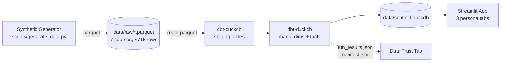

# Sentinel Fleet Ops

A small but realistic analytics stack simulating operations for a fleet of
autonomous sensor towers — perimeter monitoring, deployment tracking, component
reliability, and inventory health, all from one fact layer with three persona
views.

Built end-to-end in a single afternoon as a scoped demo of how I work as an
analytics engineer on a hardware-fleet team: synthetic data → dbt models → tests
→ a dual-audience Streamlit dashboard, deployed publicly.

**Live demo:** _(deploy URL added after Streamlit Cloud deploy)_
**Author:** [Ravi Rajpurohit](https://ravirajpurohit.com)

---

## What this shows

A fleet of 60 sensor towers across 10 sites generates 60 days of hourly
telemetry, deployments, incidents, component lifecycle events, and inventory
movements. The same fact layer powers three persona views:

| Tab | Audience | Questions answered |
|---|---|---|
| **Operations** | Site leads, ops managers | Where are towers? What's deployed where? What's broken right now? Are we about to run out of any part? |
| **Reliability** | Reliability / sustainment engineering | Are components hitting their MTBF targets? How is uptime trending? What categories of failure dominate? |
| **Data Trust** | Data team & stakeholders relying on this | Did the pipeline run? Are tests green? How fresh is each source? |

Top-line KPIs roll up the answers visitors care about most: active towers,
open incidents (with critical count), 7-day comms uptime, component failures
in the last 30 days.

---

## Architecture



**Stack:** Python · DuckDB · dbt-duckdb · Streamlit · Plotly

**Why this stack:** Every piece runs locally on a laptop, deploys to Streamlit
Cloud for free, and uses tools that are common in modern analytics-engineer
workflows (dbt + a columnar warehouse + a BI surface). No cloud account
required to reproduce.

---

## Models

**Sources (raw parquet):** `sites`, `towers`, `telemetry`, `deployments`,
`incidents`, `components`, `inventory`

**Staging** (one per source — type casts, soft renames):
- `stg_sites`, `stg_towers`, `stg_telemetry`, `stg_deployments`,
  `stg_incidents`, `stg_components`, `stg_inventory`

**Marts:**
- `dim_site` — sites enriched with tower counts and active counts
- `dim_tower` — towers joined to site metadata + age in days
- `fct_fleet_health_daily` — one row per (tower, day) with averaged telemetry,
  uptime %, sensor health, and incident counts
- `fct_deployment_status` — every deployment with duration in hours/days
- `fct_component_reliability` — every component with observed hours and
  actual-vs-target ratio for failed units
- `fct_inventory_status` — current stock with computed `available`, reorder
  flag, and a four-level `stock_status` (`critical` / `reorder` / `watch` /
  `healthy`)

**Tests:** 39 dbt tests covering uniqueness on every primary key,
not-null on foreign keys, `accepted_values` on enum columns
(`status`, `severity`, `component_type`, `stock_status`, `env`), and
`relationships` from staging back to upstream dims. Source freshness is
configured on the telemetry source in `sources.yml`.

---

## Run it locally

```bash
# 1. Create a virtualenv and install dev deps (includes dbt + numpy)
python3 -m venv .venv
source .venv/bin/activate
pip install -r requirements-dev.txt

# 2. Generate synthetic source data
python scripts/generate_data.py

# 3. Build the dbt project (compiles to data/sentinel.duckdb)
cd dbt
DBT_PROFILES_DIR=. dbt build
cd ..

# 4. Serve the Streamlit app
streamlit run streamlit_app.py
```

The runtime requirements (`requirements.txt`) only include what Streamlit Cloud
needs to serve the app — no dbt at runtime, since the compiled DuckDB file is
checked in.

---

## Design notes

- **Three personas, one fact layer.** Same `fct_fleet_health_daily` powers
  both the Operations top-of-fold KPIs and the Reliability uptime trend.
  Avoiding tab-specific tables keeps numbers consistent across views.
- **Materialize staging as tables, not views.** Default for staging is `view`,
  but views resolve `read_parquet(...)` paths at query time — which breaks the
  moment the working directory of the consumer (Streamlit) differs from the
  build directory (dbt). Materializing as tables bakes the data into the
  compiled DuckDB file, so the artifact is fully self-contained.
- **dbt artifacts in the app.** `run_results.json` and `manifest.json` are
  committed alongside the DB. The Data Trust tab parses them and surfaces
  pass/fail counts, elapsed time per step, and the last run timestamp — closing
  the loop between "I built it" and "I can prove it works."
- **Synthetic data is deterministic.** Fixed seed (`42`) so the dashboard looks
  the same every time someone opens it. Tower-level bias terms keep the
  telemetry from being homogeneous.
- **Inventory `stock_status` over a single boolean.** A four-level state
  (`critical`/`reorder`/`watch`/`healthy`) gives ops leads the prioritization
  signal a single needs-reorder flag would hide.

---

## What's intentionally out of scope

This is a one-afternoon demo, not a production system. Things I would build
next, in priority order:

1. **Real freshness alerting** — wire the `sources.yml` freshness rules into a
   notification path (Slack webhook, PagerDuty) so stale telemetry escalates
   automatically rather than waiting for someone to load the dashboard.
2. **Streaming ingest path** — replace the parquet generator with a small Kafka
   producer + ingestion job, so telemetry lands continuously rather than in
   nightly batches. (This is the architecture I ran at KaHa Technologies for
   2B+ events/month from a 10M-device wearable fleet.)
3. **Component lifecycle forecasting** — extend `fct_component_reliability` to
   predict expected-failure-windows per part using observed-vs-target ratios,
   surfaced as a proactive replacement queue tied to inventory.
4. **Site-level cohort analysis** — bucket sites by environment (`coastal`,
   `desert`, `tundra`) and ship a comparative cohort view for failure
   categories and uptime — useful when deciding what to harden in the next
   hardware revision.
5. **Auth + role-aware tabs** — tabs are filtered by role so ops leads see only
   their sites and engineering sees the whole fleet.
6. **End-to-end ERP/MRP integration** — replace the synthetic inventory source
   with a connector to a real MRP system; reconcile on-hand vs. allocated
   vs. requisitioned.

---

## License

Personal / portfolio project. Synthetic data only.
